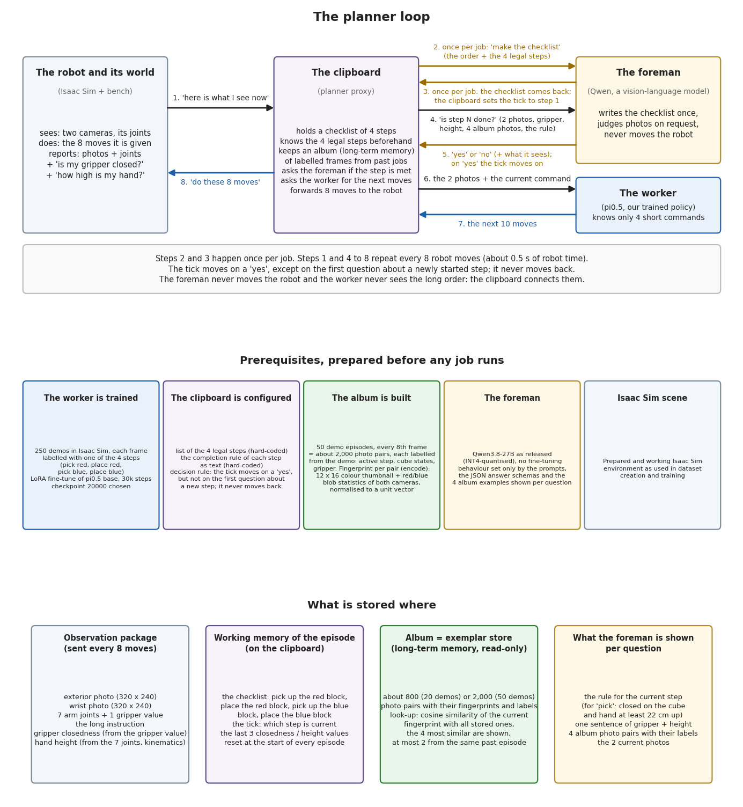

# The planner loop

The planner loop is the first memory method of the framework. The VLA policy is trained on a small set of short
skills. A vision-language model (VLM) acts as the planner: it decomposes the user's long instruction into those skills
once and then, at every policy call, judges whether the current skill is complete. A proxy between the environment and
the policy server ties the two together. It holds the plan and the current step as the working memory of the running
task, consults a store of labelled past observations as long-term memory, and hands the policy only the prompt of the
current skill.

## Concepts

The figure below uses four everyday roles. This is how they map onto the framework.

| in the figure | role | framework component |
|---|---|---|
| the robot and its world | sends an observation (camera images, joint values, the instruction) and executes the returned moves | the environment client, unchanged: it talks to the proxy exactly as it would talk to the policy server |
| the clipboard | holds the working memory, knows the legal skills and their completion rules, asks the foreman, forwards the current skill to the worker | `vla_memory/planner_loop/proxy.py` (the relay) and `vla_memory/planner_loop/planner.py` (episode state and decision rule); the task specification in `vla_memory/task.py` and `vla_memory/tasks/` |
| the foreman | writes the checklist once, judges photos on request, never moves the robot | the planning model behind `vla_memory/vlm.py`; its answers are constrained by JSON schemas to the legal skills and to yes/no |
| the worker | knows only the short skill prompts and returns the next moves | the VLA policy behind `vla_memory/transport.py` |
| the album | labelled frames from past episodes, looked up by similarity | the exemplar store in `vla_memory/planner_loop/exemplar.py` with the retrieval keys in `vla_memory/planner_loop/fingerprint.py` |

Three kinds of memory are involved:

- **Working memory** of the running episode: the plan (the checklist), the current step (the tick) and the last few
  proprioception values (gripper closedness, hand height). It lives in the planner's episode state and is reset at the
  start of every episode.
- **Long-term memory**: the exemplar store. Frames from recorded episodes are labelled with the active skill and the
  object states, each frame gets a compact numeric fingerprint, and at every question the most similar stored frames
  are retrieved (cosine similarity, at most two from the same past episode) and shown to the planner as labelled
  examples. The store is read-only during a run.
- **Symbolic state**: the task specification. It lists the legal skills, the completion rule of each skill as text,
  the answer schemas and how the proprioception is summarised. Together with the observations and the retrieved
  examples, this is all the planner is given.

The decision rule: the planner is asked once per episode for the plan and at every policy call whether the current
step is done. The tick moves on a "yes", but not on the first question about a newly started step, and it never moves
back. The number of agreeing answers, the minimum number of questions per step and the question interval are
parameters of the planner.

## The visualization

[planner_loop.pdf](planner_loop.pdf)

The figure has three panels.

1. **The loop.** Eight numbered messages. Messages 2 and 3 (make the checklist, the checklist comes back) happen once
   per episode; messages 1 and 4 to 8 repeat at every policy call, that is every 8 robot moves in the reference setup.
2. **Prerequisites** prepared before any episode runs: a policy trained on the skills, the configured task
   specification, the built store, the planning model as released (no fine-tuning) and a working environment.
3. **What is stored where**: the observation package, the working memory on the clipboard, the exemplar store, and
   what the planner is shown per question.

The figure shows the reference instantiation used for the evaluation (a simulated Franka arm, a pi0.5 policy trained
on the four skills of a red/blue block task, Qwen3.8-27B as the planner). Every named component is a replaceable part
of the framework.

## Results on the reference task

On 100 fresh seeds of the red/blue task (500 steps each, same seeds for every run), the loop with the Qwen planner and
the criteria of the task file completes 69 of 100 full tasks with an empty store (mean sequence score 5.62), 91 with
20 stored episodes (6.65), 88 with 50 (6.51) and 88 with 100 (6.54); the ground-truth oracle that switches the skill
at the labelled moment completes 92 (6.64), and the same policy without any memory or planner, driven by the full
instruction alone, completes 11 (2.33). The whole gain lies between 0 and 20 stored episodes; from 20 upwards the
planner is at the oracle's level and the differences are within noise. The per-episode videos, results files, traces and planner decision logs of these runs are on
the evaluation host under `/data/mhartmann/eval_final_v2_planner_mem{0,20,100}/`, `/data/mhartmann/eval_final_v2_planner/`
(50 episodes) and `/data/mhartmann/eval_final_v2_n100/` (oracle and memoryless baselines).

## Sources

The loop combines ideas from the following papers; none of them is used as code.

| paper | what the planner loop takes from it |
|---|---|
| SayCan (Ahn et al., 2022, arXiv 2204.01691) | a language model plans over a fixed library of trained skills; our plan step is restricted to the policy's skill vocabulary by the answer schema |
| Inner Monologue (Huang et al., CoRL 2022, arXiv 2207.05608) | closed-loop planning: success detection fed back to the planner after every step; its catalogue of detector errors (false negatives cause useless retries, false positives create partial observability) motivates the vote threshold, the minimum number of questions per skill and the forward-only pointer |
| Vision-Language Models as Success Detectors, SuccessVQA (Du et al., 2023, arXiv 2303.07280) | a VLM judges from images whether a step is complete; this is the monitor query |
| Hi Robot (Shi et al., 2025, arXiv 2502.19417) | a high-level VLM issues short language commands to a low-level VLA from the current images; the same two-level split, here prompt-based and with an explicit state instead of a trained high-level model |
| Gemini Robotics 1.5 (DeepMind, 2025, arXiv 2510.03342) | an orchestrator model decomposes the task and runs success detection to decide when to switch skills |
| VoLo (Chen et al., 2026, arXiv 2606.07723) and 2AM (Hu et al., 2026, arXiv 2609.11308) | an orchestrator VLM drives a stateless pi0.5 and holds the task state; VoLo's finding that completion-monitor errors dominate is why the long-term memory serves the monitor |
| RAP (Kagaya et al., 2024, arXiv 2402.03610) and JARVIS-1 (Wang et al., 2023, arXiv 2311.05997) | retrieval of past experience as in-context examples for a planner; the exemplar store is such a memory with a hand-made visual key, feeding few-shot examples to the monitor |
